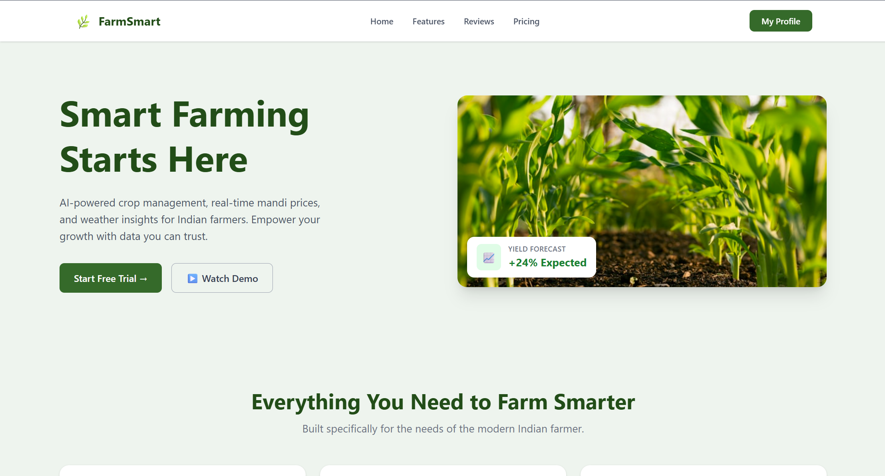
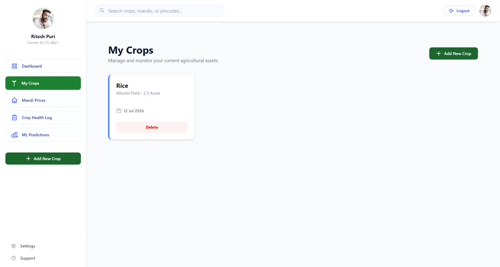
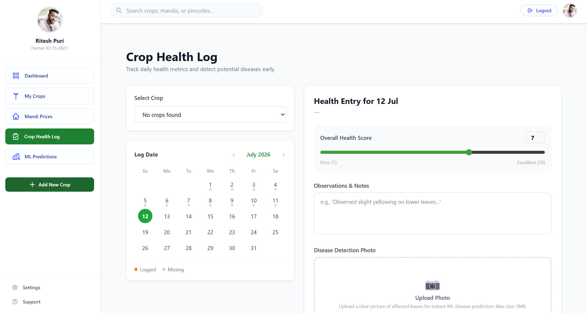
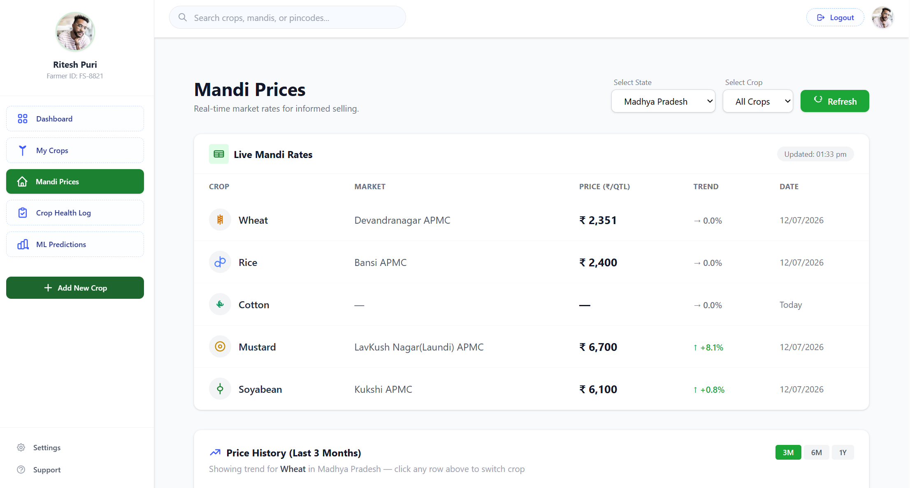
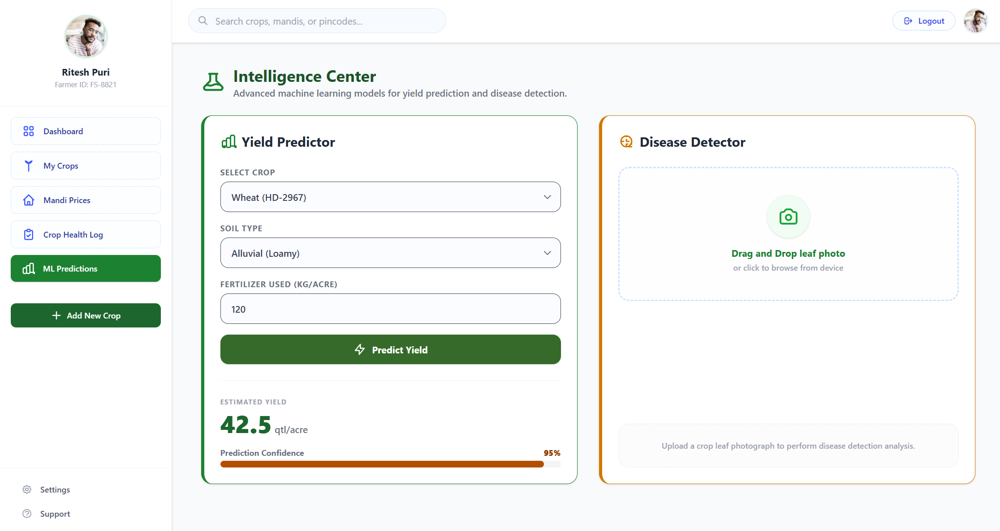

# 🌾 FarmSmart

> **A modern full-stack smart agriculture platform that empowers farmers with real-time weather updates, live mandi prices, crop management, health tracking, and AI-powered farming insights.**


---

## 📖 Overview

FarmSmart is a full-stack smart agriculture platform built to help farmers make data-driven decisions. The platform provides live weather forecasts, real-time mandi prices, crop lifecycle management, crop health tracking, secure authentication, and premium subscription support.

The project follows a scalable architecture with separate React and Express applications, containerized using Docker and Docker Compose.

---

# 📸 Screenshots


## 🏠 Landing Page



---

## 📊 Dashboard


---

## 🌱 My Crops



---

## 📸 Crop Health Logger



---

## 💹 Live Mandi Prices



---
## 💹 ML Prediction



---

## ✨ Features

- ✅ Secure JWT Authentication
- ✅ OTP-based Password Recovery (Nodemailer)
- ✅ Razorpay Payment Integration
- ✅ Crop Management (CRUD)
- ✅ Crop Health Diary with Image Uploads
- ✅ Cloudinary Image Storage
- ✅ Live Weather Updates (OpenWeatherMap)
- ✅ Live Mandi Prices (Government of India API)
- ✅ Dockerized Full-Stack Deployment
- 🔄 AI Disease Detection *(Coming Soon)*
- 🔄 Crop Yield Prediction *(Coming Soon)*

---

# 🏗️ System Architecture

```text
                 Browser
                     │
                     ▼
          React Frontend (Docker)
                     │
               REST API Calls
                     ▼
         Express Backend (Docker)
                     │
     PostgreSQL Database + External APIs
                     │
        ├── OpenWeather API
        ├── Government Data API
        ├── Cloudinary
        └── Razorpay
```

---

# 🛠️ Tech Stack

## Frontend

- React (Vite)
- React Router DOM
- Tailwind CSS
- React Context API
- Axios

## Backend

- Node.js
- Express.js
- PostgreSQL
- JWT Authentication
- Bcrypt
- Nodemailer
- Node Cache
- Cloudinary
- Razorpay

## DevOps

- Docker
- Docker Compose
- Nginx

---

# 🌐 External APIs

- 🌦 OpenWeatherMap API
- 📈 Government of India Mandi Price API
- ☁️ Cloudinary API
- 💳 Razorpay API

---

# 📁 Repository Structure

```text
FarmSmart/
│
├── backend/
│   ├── src/
│   │   ├── config/
│   │   ├── controllers/
│   │   ├── middleware/
│   │   └── routes/
│   ├── Dockerfile
│   └── package.json
│
├── frontend/
│   ├── src/
│   ├── public/
│   ├── Dockerfile
│   ├── nginx.conf
│   └── package.json
│
├── screenshots/
│
├── docker-compose.yml
├── sqlScript.sql
└── README.md
```

---

# ⚙️ Installation

## Prerequisites

- Node.js 18+
- PostgreSQL
- Docker Desktop (Optional)

---

## 1️⃣ Clone Repository

```bash
git clone https://github.com/ritesh2006-web/FarmSmart.git

cd FarmSmart
```

---

## 2️⃣ Setup PostgreSQL

Create a PostgreSQL database.

Run

```sql
sqlScript.sql
```

to create the required tables.

---

## 3️⃣ Configure Environment Variables

### Backend

Create

```text
backend/.env
```

```env
DATABASE_URL=postgresql://<username>:<password>@localhost:5432/<database>

JWT_SECRET=your_secret

JWT_EXPIRES_IN=1d

PORT=5000

EMAIL_USER=your_email@gmail.com
EMAIL_PASS=your_app_password

OPENWEATHER_API_KEY=your_key

DATA_GOV_API_KEY=your_key

CLOUDINARY_CLOUD_NAME=your_name
CLOUDINARY_API_KEY=your_key
CLOUDINARY_API_SECRET=your_secret

RAZORPAY_KEY_ID=your_key
RAZORPAY_KEY_SECRET=your_secret
```

---

### Frontend

Create

```text
frontend/.env
```

```env
VITE_API_URL=http://localhost:5000
```

---

# 🐳 Running with Docker (Recommended)

```bash
docker compose up --build
```

Frontend

```
http://localhost:3000
```

Backend

```
http://localhost:5000
```

---

# 💻 Running Without Docker

### Backend

```bash
cd backend

npm install

npm run dev
```

---

### Frontend

```bash
cd frontend

npm install

npm run dev
```

---

# 🔐 Security

- Password hashing using Bcrypt
- JWT Authentication
- Protected API Routes
- Secure Environment Variables
- Dockerized Deployment

---

# 🚀 Future Roadmap

- [x] User Authentication
- [x] Crop Management
- [x] Weather Integration
- [x] Mandi Price Integration
- [x] Razorpay Payment Gateway
- [x] Docker Support
- [ ] ML Disease Detection
- [ ] Crop Yield Prediction
- [ ] SMS Notifications
- [ ] Multi-language Support
- [ ] Farmer Community Forum

---

# 👨‍💻 Author

**Ritesh Puri**

B.Tech Student | Full Stack Developer

GitHub: https://github.com/ritesh2006-web

---

# 📄 License

This project is licensed under the **MIT License**.
